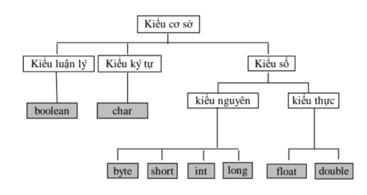
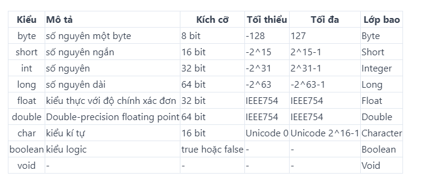
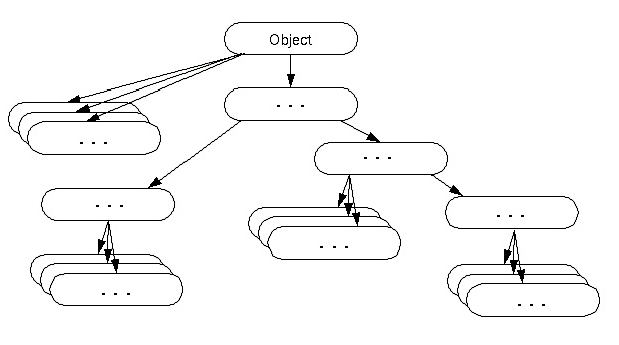
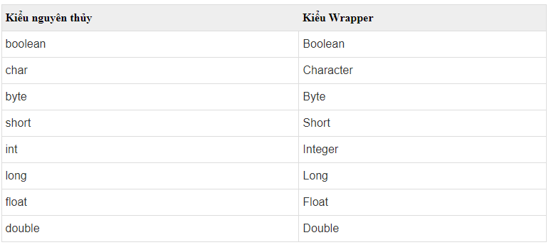

 #  [JAVA] BUỔI 3: CÁCH JAVA LƯU TRỮ DỮ LIỆU 

 ***

## 1. Cách java lưu trữ dữ liệu 

>*Tài liệu tham khảo*:  [Kiểu dữ liệu](http://that2u.com/java-kieu-du-lieu-nguyen-thuy-va-kieu-du-lieu-tham-chieu/)

Java có 2 loại kiểu dữ liệu:

- Các kiểu dữ liệu nguyên thủy 
- Các kiểu dữ liệu đối tượng (tham chiếu)
### 1.1: Kiểu dữ liệu nguyên thủy
- Có 8 kiểu dữ liệu nguyên thủy (Primitive Data type) đó là: boolean, byte, char, short, int, long, float, double.


### 1.2: Kiểu dữ liệu đối tượng

- Một số ví dụ về kiểu dữ liệu tham chiếu như là: Object, List, Array, … và tất nhiên tất cả các class mà bạn tạo ra đều là kiểu dữ liệu tham chiếu.

Phân biệt 2 kiểu dữ liệu:

- Kiểu dữ liệu nguyên thủy lưu trữ dữ liệu trong chính bản thân nó.
- Còn kiểu dữ liệu tham chiếu chỉ lưu trữ 1 giá trị là địa chỉ đến vùng nhớ mà nó tham chiếu đến. Các vùng nhớ này mới là nơi lưu trữ các thuộc tính của các đối tượng mà kiểu dữ liệu tham chiếu chỉ đến. (tương tự như khái niệm con trỏ trong C/C++ vậy)

**Ví dụ về Kiểu dữ liệu nguyên thủy:**

```
public static void main(String[] args) {
 
int x = 10;
int y = x;
System.out.println("Before assign");
System.out.println("x = "+x);
System.out.println("y = "+y);
y = 8;
System.out.println("After assign");
System.out.println("x = "+x);
System.out.println("y = "+y);
}
```
Và đây là kết quả:

```
Before assign
X = 10
y = 10
After assign
X = 10
y = 8

```
*--> Bạn sẽ thấy rằng sau khi gán y=8 thì chỉ có giá trị của y thay đổi còn giá trị của x không thay đổi*

**Ví dụ về Kiểu dữ liệu tham chiếu:**

```
public class ReferenceTypeExample {
int value = 10;
}
 
public static void main(String[] args) {
ReferenceTypeExample x = new ReferenceTypeExample();
ReferenceTypeExample y = x;
 
System.out.println("Before assign");
System.out.println("x = "+x.value);
System.out.println("y = "+y.value);
 
y.value = 8;
System.out.println("After assign");
System.out.println("x = "+x.value);
System.out.println("y = "+y.value);
}
```

Và đây là kết quả:

```
Before assign
x = 10
y = 10
After assign
x = 8
y = 8
```

*--> Bạn sẽ thấy rằng sau khi gán y.value=8 thì giá trị value của cả x và y đều thay đổi (trở thành 8)*

### 1.3: class object

>*Tài liệu tham khảo*: [Lớp Object trong java](https://viettuts.vn/java/lop-object-trong-java)

Mặc định lớp Object là lớp cha của tất cả các lớp trong java. 




Sử dụng lớp Object là hữu ích nếu bạn muốn tham chiếu bất kỳ đối tượng nào mà bạn chưa biết kiểu dữ liệu của đối tượng đó.

****Ví dụ:*** giả sử phương thức getObject() trả về một đối tượng nhưng nó có thể là bất kỳ kiểu nào như Employee,Student, ... chúng ta có thể sử dụng biến tham chiếu của lớp Object để tham chiếu tới đối tượng đó.*

```
Object obj=getObject(); // chúng ta không biết đối tượng gì được trả về từ phương thức này.
```
Lớp Object cung cấp một vài cách xử lý chung cho tất cả các đối tượng như đối tượng có thể được so sánh, đối tượng có thể được cloned, đối tượng có thể được notified...

### 1.4: Lớp Wrapper trong java

>*Tài liệu tham khảo* [Wrapper](https://viettuts.vn/java/lop-wrapper-trong-java)

Lớp Wrapper trong java cung cấp cơ chế để chuyển đổi kiểu dữ liệu nguyên thủy thành kiểu đối tượng và từ đối tượng thành kiểu dữ liệu nguyên thủy.

Sự chuyển đổi tự động kiểu dữ liệu nguyên thủy thành kiểu đối tượng được gọi là autoboxing và ngược lại được gọi là unboxing.

*Trong java, có 8 lớp Wrapper chúng được thiết kế trong gói java.lang.*



*Ví dụ chuyển kiểu dữ liệu nguyên thủy thành kiểu Wrapper*

```
public class WrapperExample1 {
    public static void main(String args[]) {
        // Đổi int thành Integer
        int a = 20;
        Integer i = Integer.valueOf(a);// đổi int thành Integer
        Integer j = a;// autoboxing, tự động đổi int thành Integer trong nội bộ trình biên dịch
 
        System.out.println(a + " " + i + " " + j);
    }
}
```
Output:

```
20 20 20
```


Ví dụ chuyển kiểu Wrapper thành kiểu dữ liểu nguyên thủy:
```
public class WrapperExample2 {
    public static void main(String args[]) {
        // đổi Integer thành int
        Integer a = new Integer(3);
        int i = a.intValue();// đổi Integer thành int
        int j = a;// unboxing, tự động đổi Integer thành int trong nội bộ trình biên dịch
 
        System.out.println(a + " " + i + " " + j);
    }
}
```

Output:

```
3 3 3
```


### 1.5: Autoboxing và unboxing
> Link tham khảo: [Auto-Unboxing](https://viettuts.vn/java-new-features/autoboxing-va-unboxing-trong-java)

Việc chuyển đổi tự động các kiểu dữ liệu nguyên thủy thành kiểu Wrapper tương đương của nó được gọi là hoạt động autoboxing (hay boxing) và ngược lại được gọi là unboxing. Đây là tính năng mới của Java 5. Vì vậy, lập trình java không cần phải viết mã chuyển đổi.


Lợi thế của của Autoboxing và Unboxing:
- Tiết kiệm code: Không cần chuyển đổi giữa các nguyên thủy và Wrappers theo cách thủ công.

Ví dụ đơn giản về Autoboxing trong java

```
package javafeatures;
 
public class BoxingExample1 {
    public static void main(String args[]) {
        int a = 50;
        Integer a2 = new Integer(a);// Boxing
        Integer a3 = 5;             // Boxing
        System.out.println(a2 + " " + a3);
    }
```

output:
```
50 5
```

Ví dụ đơn giản về Unboxing trong java

```
package javafeatures;
 
public class UnboxingExample1 {
    public static void main(String args[]) {
        Integer i = new Integer(50);
        int a = i; // unboxing
        System.out.println(a);
    }
}
```

output:
```
50 
```
## 2. Các phương thức khởi tạo trong Java (từ khóa super và this).

> Link tham khảo: [this và super](https://gpcoder.com/2260-tu-khoa-va-super-trong-java/)

### 2.1: Từ khóa this
Từ khóa this trong java là một biến tham chiếu được sử dụng để tham chiếu tới đối tượng của lớp hiện tại.

Từ khóa this có 6 cách sử dụng sau:

- Tham chiếu tới biến instance của lớp hiện tại.
- Gọi phương thức (method) của lớp hiện tại.
- Gọi hàm dựng (constructor) của lớp hiện tại.
- Trả về instance của lớp hiện tại
- Được truyền như một tham số trong phương thức (method).
- Được truyền như một tham số trong hàm dựng (constructor).

### 2.1: Từ khóa super

Từ khóa super trong java là một biến tham chiếu được sử dụng để tham chiếu trực tiếp đến đối tượng của lớp cha gần nhất.

Bất cứ khi nào bạn tạo ra instance (thể hiện) của lớp con, một instance của lớp cha được tạo ra ngầm định, nghĩa là được tham chiếu bởi biến super.

Từ khóa super có 3 cách sử dụng sau:

- Gọi trực tiếp hàm dựng (constructor) của lớp cha gần nhất.
- Gọi trực tiếp thuộc tính (field) của lớp cha gần nhất.
- Gọi trực tiếp phương thức (method) của lớp cha gần nhất.

## 3. Garbage Collector trong Java .

> Link tham khảo: [Garbage Collector](https://viettuts.vn/java-thread/garbage-collection-trong-java)

Trong java, rác (garbage) có nghĩa là các đối tượng không còn được tham chiếu nữa.

Bộ thu gom rác (Garbage Collection) trong java được sử dụng để thực hiện quá trình tự động khôi phục lại bộ nhớ không được sử dụng tại runtime một cách tự động. Nói cách khác, đó là một cách để phá hủy các đối tượng không sử dụng nữa.

> Ưu điểm của Garbage Collection:
- Nó làm cho việc sử dụng bộ nhớ java hiệu quả bởi vì bộ thu gom rác (Garbage Collection) loại bỏ các đối tượng không được tham chiếu từ bộ nhớ heap.
- Nó được được thực hiện tự động bởi trình thu gom rác (một phần của JVM) vì vậy chúng ta không cần phải nỗ lực nhiều để giải phóng bộ nhớ.

>Làm thế nào có thể một đối tượng không được tham chiếu?

- Bởi gán giá trị null.
- Bởi việc gán đối tượng đến một tham chiếu khác;
- Bởi một đối tượng annonymous.

Ví dụ về garbage collection trong java
```
public class TestGarbage1 {
    public void finalize() {
        System.out.println("object is garbage collected");
    }
 
    public static void main(String args[]) {
        TestGarbage1 s1 = new TestGarbage1();
        TestGarbage1 s2 = new TestGarbage1();
        s1 = null;
        s2 = null;
        System.gc();
    }
}
```

Output:

```
object is garbage collected
object is garbage collected
```

## 4: Pass by value trong Java 

> Link tham khảo: [Pass by value](https://viettuts.vn/java/truyen-gia-tri-va-tham-chieu-pass-value-va-pass-reference-trong-java)

Nếu chúng ta gọi một phương thức và truyền một giá trị cho phương thức đó được gọi là truyền giá trị. Việc thay đổi giá trị chỉ có hiệu lực trong phương thức được gọi, không có hiệu lực bên ngoài phương thức.

Khi chúng ta gọi một phương thức và truyền một tham chiếu cho phương thức đó được gọi là truyền tham chiếu. Việc thay đổi giá trị của biến tham chiếu bên trong phương thức làm thay đổi giá trị gốc của nó.

>Ví dụ về việc truyền giá trị (pass by value) trong java

```
public class Operation1 {
    int data = 50;
 
    void change(int data) {
        data = data + 100;
    }
 
    public static void main(String args[]) {
        Operation1 op = new Operation1();
 
        System.out.println("Trước khi thay đổi: " + op.data);
        op.change(500);
        System.out.println("Sau khi thay đổi: " + op.data);
    }
}
```

Output:

```
Trước khi thay đổi: 50
Sau khi thay đổi: 50
```

*Trong ví dụ này, giá trị data không bị thay đổi sau khi gọi phương thức change()*


