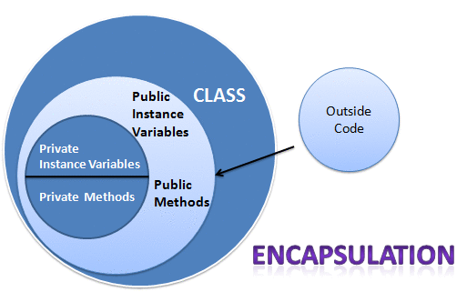
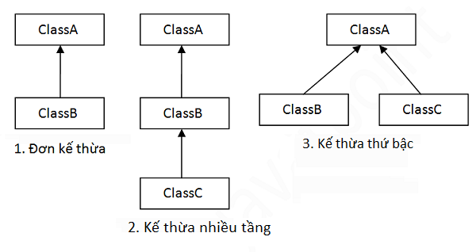
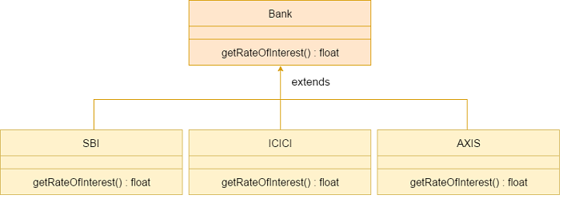

 #  [JAVA] BUỔI 4: MỌI THỨ ĐỀU LÀ ĐỐI TƯỢNG

 ***
## 1. Tính đóng gói trong Java

>*Tài liệu tham khảo*:  [Tính đóng gói](https://viettuts.vn/java/tinh-dong-goi-trong-java)
- Tính đóng gói trong java là kỹ thuật ẩn giấu thông tin không liên quan và hiện thị ra thông liên quan. Mục đích chính của đóng gói trong java là giảm thiểu mức độ phức tạp phát triển phần mềm.
  


# 1.1: Lợi ích của đóng gói trong java
- Bạn có thể tạo lớp read-only hoặc write-only bằng việc cài đặt phương thức setter hoặc getter.
- Bạn có thể kiểm soát đối với dữ liệu. Giả sử bạn muốn đặt giá trị của id chỉ lớn hơn 100 bạn có thể viết logic bên trong lớp setter.
# 1.2: Ví dụ về đóng gói trong java
- Hãy xem ví dụ sau về đóng gói trong java với một lớp chỉ có một trường và các phướng thức setter và getter của nó.
  
*File: Student.java*

```
public class Student {
    private String name;
 
    public String getName() {
        return name;
    }
 
    public void setName(String name) {
        this.name = name;
    }
}
```
*File: Test.java*
```
class Test {
    public static void main(String[] args) {
        Student s = new Student();
        s.setName("Hai");
        System.out.println(s.getName());
    }
}
```
*Kết quả*
```
Hai
```

## 2. Tính kế thừa trong java

>*Tài liệu tham khảo*:  [Tính kế thừa](https://viettuts.vn/java/tinh-ke-thua-trong-java)

- ***Kế thừa trong java*** là sự liên quan giữa hai class với nhau, trong đó có class cha (superclass) và class con (subclass). Khi kế thừa class con được hưởng tất cả các phương thức và thuộc tính của class cha. Tuy nhiên, nó chỉ được truy cập các thành viên public và protected của class cha. Nó không được phép truy cập đến thành viên private của class cha.

### 2.1: Cú pháp của kế thừa trong java

Sử dụng từ khóa ***extends*** để kế thừa.
```
class Subclass-name extends Superclass-name {  
   //methods and fields
}  
```

### 2.2: Ví dụ về kế thừa trong java
 ```
 class Employee {
    float salary = 1000;
}
 
class Programmer extends Employee {
    int bonus = 150;
}
 
public class InheritanceSample1 {
    public static void main(String args[]) {
        Programmer p = new Programmer();
        System.out.println("Programmer salary is: " + p.salary);
        System.out.println("Bonus of Programmer is: " + p.bonus);
    }
}
 ```
 
 Kết quả:
 
 ```
Programmer salary is: 1000.0
Bonus of Programmer is: 150
 ```
 - Trong ví dụ trên class Programmer là con của class Employee, nên nó được phép truy cập đến trường salary của class cha.


### 2.3: Các kiểu kế thừa trong java
Có 3 kiểu kế thừa trong java đó là đơn kế thừa, kế thừa nhiều cấp, kế thừa thứ bậc.

Khi một class được kế thừa từ nhiều class đươc gọi là đa kế thừa. Trong java, đa kế thừa chỉ được support thông qua interface, như đã được nói đến trong bài interface trong java


### 2.3: Ví dụ về đơn kế thừa
File: TestInheritance1.java
```
class Animal {
    void eat() {
        System.out.println("eating...");
    }
}
 
class Dog extends Animal {
    void bark() {
        System.out.println("barking...");
    }
}
 
public class TestInheritance1 {
    public static void main(String args[]) {
        Dog d = new Dog();
        d.bark();
        d.eat();
    }
}
```

Output:

```
barking...
eating...
```

### 2.4: Ví dụ về kế thừa nhiều cấp

```
cclass Animal {
    void eat() {
        System.out.println("eating...");
    }
}
 
class Dog extends Animal {
    void bark() {
        System.out.println("barking...");
    }
}
 
class BabyDog extends Dog {
    void weep() {
        System.out.println("weeping...");
    }
}
 
public class TestInheritance2 {
    public static void main(String args[]) {
        BabyDog d = new BabyDog();
        d.weep();
        d.bark();
        d.eat();
    }
}
```

Output:

```
weeping...
barking...
eating...
```

### 2.5: Ví dụ về kế thừa thứ bậc

```
cclass Animal {
    void eat() {
        System.out.println("eating...");
    }
}
 
class Dog extends Animal {
    void bark() {
        System.out.println("barking...");
    }
}
 
class Cat extends Animal {
    void meow() {
        System.out.println("meowing...");
    }
}
 
public class TestInheritance3 {
    public static void main(String args[]) {
        Cat c = new Cat();
        c.meow();
        c.eat();
        // c.bark(); // compile error
    }
}
```

Output:

```
meowing...
eating...
```
## 3. Tính đa hình trong java

***Đa hình trong java (Polymorphism)*** là một khái niệm mà chúng ta có thể thực hiện một hành động bằng nhiều cách khác nhau. Polymorphism được cấu tạo từ 2 từ Hy Lạp: poly và morphs. Trong đó "poly" có nghĩa là nhiều và "morphs" có nghĩa là hình thể. Vậy polymorphism có nghĩa là nhiều hình thể.

3.1: Đa hình lúc runtime trong java
- Đa hình lúc runtime là quá trình gọi phương thức đã được ghi đè trong thời gian thực thi chương trình. Trong quá trình này, một phương thức được ghi đè được gọi thông qua biến tham chiếu của một lớp cha.

3.2: Upcasting là gì?
- Khi biến tham chiếu của lớp cha tham chiếu tới đối tượng của lớp con, thì đó là Upcasting. Ví dụ:

```
class A{}  
class B extends A{}
```

```
A a=new B();//upcasting  
```

3.2: Ví dụ về đa hình lúc runtime trong java

***Ví dụ 1:***

- Chúng ta tạo hai lớp Bike và Splendar. Lớp Splendar kế thừa lớp Bike và ghi đè phương thức run() của nó. Chúng ta gọi phương thức run bởi biến tham chiếu của lớp cha. Khi nó tham chiếu tới đối tượng của lớp con và phương thức lớp con ghi đè phương thức của lớp cha, phương thức lớp con được gọi lúc runtime.

- Khi việc gọi phương thức được quyết định bởi JVM chứ không phải Compiler, vì thế đó là đa hình lúc runtime.

```
class Bike {
    void run() {
        System.out.println("running");
    }
}
 
public class Splender extends Bike {
    void run() {
        System.out.println("running safely with 60km");
    }
 
    public static void main(String args[]) {
        Bike b = new Splender();// upcasting
        b.run();
    }
}
```
Kết quả:
```
running safely with 60km
```

***Ví dụ 2: Bank:***

- Giả sử Bank là một lớp cung cấp chức năng xem thông tin tỷ lệ lãi suất. Nhưng mỗi ngân hàng có một lãi xuất khác nhau, ví dụ các ngân hàng SBI, ICICI và AXIS có tỷ lệ lãi suất lần lượt là 8%, 7% và 9%.



```
class Bank {
    int getRateOfInterest() {
        return 0;
    }
}
 
class SBI extends Bank {
    int getRateOfInterest() {
        return 8;
    }
}
 
class ICICI extends Bank {
    int getRateOfInterest() {
        return 7;
    }
}
 
class AXIS extends Bank {
    int getRateOfInterest() {
        return 9;
    }
}
 
public class Test2 {
    public static void main(String args[]) {
        Bank b;
        b = new SBI();
        System.out.println("SBI Rate of Interest: " + b.getRateOfInterest());
        b = new ICICI();
        System.out.println("ICICI Rate of Interest: " + b.getRateOfInterest());
        b = new AXIS();
        System.out.println("AXIS Rate of Interest: " + b.getRateOfInterest());
    }
}
```

Kết quả:

```
SBI Rate of Interest: 8
ICICI Rate of Interest: 7
AXIS Rate of Interest: 9
```

###3.3: Đa hình lúc runtime trong Java với thành viên dữ liệu
- Phương thức bị ghi đè không là thành viên dữ liệu, vì thế đa hình tại runtime không thể có được bởi thành viên dữ liệu. Trong ví dụ sau đây, cả hai lớp có một thành viên dữ liệu là speedlimit, chúng ta truy cập thành viên dữ liệu bởi biến tham chiếu của lớp cha mà tham chiếu tới đối tượng lớp con. Khi chúng ta truy cập thành viên dữ liệu mà không bị ghi đè, thì nó sẽ luôn luôn truy cập thành viên dữ liệu của lớp cha.

```
class Bike{  
 int speedlimit=90;  
}  
class Honda3 extends Bike{  
 int speedlimit=150;  
   
 public static void main(String args[]){  
  Bike obj=new Honda3();  
  System.out.println(obj.speedlimit);//90  
}  
```
Kết quả:
```
90
```

### Đa hình lúc runtime trong Java với kế thừa nhiều tầng

*** Ví dụ 1: ***

```
class Animal {
    void eat() {
        System.out.println("eating");
    }
}
 
class Dog extends Animal {
    void eat() {
        System.out.println("eating fruits");
    }
}
 
class BabyDog extends Dog {
    void eat() {
        System.out.println("drinking milk");
    }
 
    public static void main(String args[]) {
        Animal a1, a2, a3;
        a1 = new Animal();
        a2 = new Dog();
        a3 = new BabyDog();
        a1.eat();
        a2.eat();
        a3.eat();
    }
}
```

Kết quả:

```
eating
eating fruits
drinking Milk
```

*** Ví dụ 2: ***

```
class Animal {
    void eat() {
        System.out.println("animal is eating...");
    }
}
 
class Dog extends Animal {
    void eat() {
        System.out.println("dog is eating...");
    }
}
 
class BabyDog1 extends Dog {
    public static void main(String args[]) {
        Animal a = new BabyDog1();
        a.eat();
    }
}
```

Kết quả:

```
Dog is eating
```
- Vì BabyDog1 không ghi đè phương thức eat(), nên phương thức eat() của lớp Dog được gọi.

