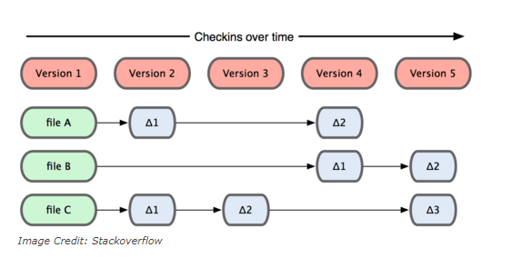
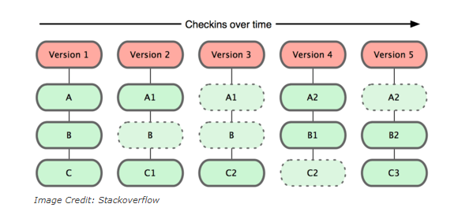
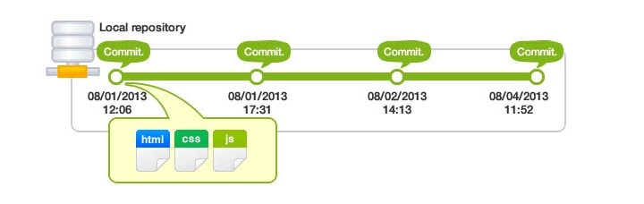

 #  [JAVA] BUỔI 5: DEV THÌ KHÔNG CHỈ VIẾT CODE

***
## 1. Version Control
- VCS là viết tắt của Version Control System là hệ thống kiểm soát các phiên bản phân tán mã nguồn mở. Các VCS sẽ lưu trữ tất cả các file trong toàn bộ dự án và ghi lại toàn bộ lịch sử thay đổi của file. Mỗi sự thay đổi được lưu lại sẽ được vàthành một version (phiên bản).

- VCS nghĩa là hệ thống giúp lập trình viên có thể lưu trữ nhiều phiên bản khác nhau của một mã nguồn được nhân bản (clone) từ một kho chứa mã nguồn (repository), mỗi thay đổi vào mã nguồn trên local sẽ có thể ủy thác (commit) rồi đưa lên server nơi đặt kho chứa chính.
- Một số Version control phổ biến bao gồm Git, Mercurial, và SVN. Git là một trong những VCS phổ biến nhất, được sử dụng rộng rãi trong cộng đồng phát triển phần mềm.


### 1.1: Tác dụng
- Lưu lại lịch sử các version của bất kỳ thay đổi nào của dự án. Giúp xem lại các sự thay đổi hoặc khôi phục (revert) lại sau này.
   
- Việc chia sẻ code trở nên dễ dàng hơn, lập trình viên có thể để public cho bất kỳ ai, hoặc private chỉ cho một số người có thẩm quyền có thể truy cập và lấy code về.
  
### 2: Khái niệm về Git

>*Tài liệu tham khảo*:[Git](https://topdev.vn/blog/git-la-gi/)

 - K/N: Git là một hệ thống quản lý phiên bản phân tán (Distributed Version Control System – DVCS), nó là một trong những hệ thống quản lý phiên bản phân tán phổ biến nhất hiện nay. Git cung cấp cho mỗi lập trình viên kho lưu trữ (repository) riêng chứa toàn bộ lịch sử thay đổi.

-  Về mặt khái niệm, hầu hết các hệ thống khác coi thông tin chúng lưu giữ dưới dạng một tập hợp các file và những thay đổi được thực hiện đối với mỗi file theo thời gian.


- Git không nghĩ đến hoặc lưu trữ dữ liệu của mình theo cách này. Thay vào đó, Git coi thông tin được lưu trữ là một tập hợp các snapshot – ảnh chụp toàn bộ nội dung tất cả các file tại thời điểm. 

- Mỗi khi bạn “commit”, Git sẽ “chụp” và tạo ra một snapshot cùng một tham chiếu tới snapshot đó. Để hiệu quả, nếu các tệp không thay đổi, Git sẽ không lưu trữ lại file — chỉ là một liên kết đến tệp giống file trước đó mà nó đã lưu trữ. Git nghĩ về dữ liệu của nó giống như dưới đây:


### 2.1: Repository

- Là nơi lưu trữ tất cả những thông tin cần thiết để duy trì và quản lý các sửa đổi và lịch sử của dự án (nơi trữ source code và các thay đổi trên đống source code này).

- Có 2 loại repository:

    - **Local Repository**: là repository nằm trên chính máy tính của chúng ta, repository này sẽ đồng bộ hóa với remote repository bằng các lệnh của git.
    - **Remote Repository**: là repository được cài đặt trên server chuyên dụng. Ví dụ: GitHub, GitLab, Bitbucket,...
- Khi tự khởi tạo một repository, chúng ta gõ lệnh `$ git init`, lệnh này sẽ tạo ra một thư mục `.git` và đây chính là repository còn phần code nằm cùng với thư mục `.git` được gọi là ``Working Directory``.

### 2.2: Branch

- Các **Branch** (nhánh) đại diện cho các phiên bản cụ thể của một kho lưu trữ tách ra từ project chính của bạn.

- **Branch** cho phép bạn theo dõi các thay đổi thử nghiệm bạn thực hiện đối với kho lưu trữ và có thể hoàn nguyên về các phiên bản cũ hơn.
  


### 2.3: Commit

- Một commit đại diện cho một thời điểm cụ thể trong lịch sử dự án của bạn. Sử dụng lệnh commit kết hợp với lệnh git add để cho git biết những thay đổi bạn muốn lưu vào local repository.
- Là thao tác để lưu lại trạng thái hiện tại trên hệ thống, ghi nhận lại lịch sử các xử lý: thêm, xóa, cập nhật các file hay thư mục trên repository.



### 2.4: Merge

-Được dùng khi ta muốn gộp hai branch lại với nhau, thao tác này thường dùng để merge branch khác vào branch chính trước khi push lên remote repository, hoặc merge hai branch thành một để giải quyết chung một task.

>Lệnh:

```
$ git merge <branch_name>

$ git merge <branch-name> <merged-branch-name>
```

### 2.5: Pull

- Lệnh dùng để tải xuống dữ liệu từ một Remote repository và cập nhật Local repository phù hợp với dữ liệu đó. Nói cách khác, Git Pull là lệnh hợp nhất các thay đổi từ Remote repository vào Local repository.

>Lệnh:

```
$ git pull origin master
```

### 2.6. Push
- Là hành động đưa những thay đổi đã commit lên một branch nào đó ở `remote repository` hoặc một branch mới hoàn toàn lên `remote repository`. 

>Lệnh:

```
$ git push origin <name_branch>
```

### 2.7. Clone
- Sao chép một repository có sẵn về local.

>Câu lệnh:

```
git clone /đường-dẫn-đến-repository/
```

### 2.8. Fork

- Là hành động tạo một bản sao của repository gốc thành một repository của bạn. Việc fork một repository cho phép bạn dễ dàng chỉnh sửa, thay đổi source code mà không ảnh hưởng tới source gốc.
- Khác với `fork`, `clone` nó là một bản remote local copy của một số kho lưu trữ. Khi bạn sao chép, bạn đang sao chép toàn bộ repo, bao gồm tất cả lịch sử và các nhánh.

## 3. Khi nào cần Pull Request? Cách tạo Pull Request

>*Tài liệu tham khảo*:[Git](https://stringee.com/vi/blog/post/pull-request-la-gi)

3.1: Pull Request là gì?

- Pull Request là một tính năng của hệ thống quản lý mã nguồn (source control management) như Git, GitHub, hay GitLab. Nó là một cách để người dùng có thể đề xuất thay đổi vào mã nguồn của một dự án đã được lưu trữ trên hệ thống quản lý mã nguồn đó.

3.2:Tại sao Pull Request lại quan trọng đến vậy?
- Pull Request là một tính năng gần như không thể thiếu trong quản lý mã nguồn bởi vì nó đóng vai trò cực kỳ quan trọng trong quá trình phát triển và duy trì mã nguồn của một dự án:

    - Đảm bảo chất lượng mã nguồn: Pull Request giúp đảm bảo rằng tất cả các thay đổi trên mã nguồn đã được xem xét và kiểm tra kỹ lưỡng trước khi hợp nhất vào branch chính. Nhờ đó, giúp tránh được các lỗi và xung đột trong quá trình phát triển.
    - Giúp đơn giản hóa quy trình kiểm tra code: Pull Request cho phép người tham gia dự án có thể đóng góp thay đổi vào mã nguồn một cách dễ dàng. Nó cũng giúp đơn giản hóa quy trình kiểm tra và chấp nhận các thay đổi.
    - Tăng tính minh bạch và sự tham gia của cộng đồng: Pull Request cho phép cộng đồng tham gia vào quá trình phát triển, giúp tăng sự minh bạch và động lực cho các thành viên khác trong dự án.
    - Đóng góp vào phát triển dự án: Pull Request cho phép các nhà phát triển đóng góp ý tưởng mới và thay đổi vào dự án một cách dễ dàng. Nhờ đó, dự án sẽ phát triển một cách nhanh chóng và có tính đột phá hơn.
    
    Tóm lại, Pull Request là một công cụ mạnh mẽ cho phép các nhà phát triển và cộng đồng đóng góp và phát triển mã nguồn của một dự án một cách chính xác và hiệu quả.

### 3.3. Cách tạo 1 Pull Request trên Github
- **Bước 1: Fork dự án gốc**

    \- Truy cập vào dự án gốc trên GitHub.

    \- Nhấn vào nút “Fork” ở góc trên bên phải để sao chép dự án vào tài khoản của bạn.

- **Bước 2: Clone dự án về máy**

    \- Truy cập vào repository đã fork trong tài khoản của bạn.
Sao chép URL của repository.

    \- Mở Terminal và sử dụng lệnh `git clone` để clone dự án về máy.
- **Bước 3: Tạo nhánh mới**
    
    \- Mở Terminal trong thư mục dự án đã clone.
    
    \- Sử dụng lệnh `git checkout -b [name_branch]` để tạo và chuyển đổi sang một nhánh mới.

- **Bước 4: Thực hiện thay đổi**

    \- Mở dự án trong trình chỉnh sửa mã nguồn.

    \- Thực hiện các thay đổi cần thiết và lưu lại.

- **Bước 5: Commit và Push**
    
    \- Mở Terminal và sử dụng lệnh `git add . ` để thêm các thay đổi vào danh sách commit.

    \- Sử dụng lệnh `git commit -m "Mô tả commit"` để commit các thay đổi đã thêm.

    \- Sử dụng lệnh `git push origin [name_branch]` để đẩy thay đổi lên repository của bạn trên GitHub.

- **Bước 6: Tạo Pull Request**

    \- Truy cập vào repository của bạn trên GitHub.

    \- Nhấn vào nút **“Compare & pull request”** bên cạnh tên nhánh của bạn.

    \- Điền thông tin cần thiết, mô tả về Pull Request và nhấn **“Create Pull Request“**
    .
- **Bước 7: Kiểm tra và xử lý yêu cầu chỉnh sửa**

- **Bước 8: Pull Request được chấp nhận và merge**